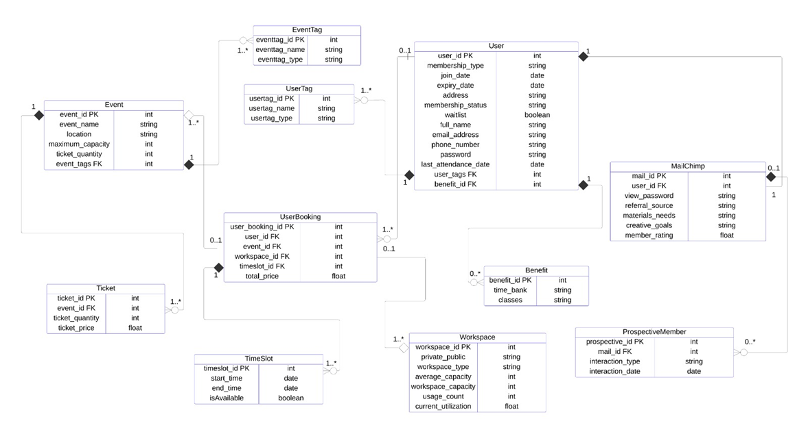

# 2. Database Design

## Fig 1: Extended Entity Relationship Diagram (EERD)

Below is the Extended Entity Relationship Diagram (EERD) for the Together Culture Database System.

Fig1: Illustrates the EERD of our database, we built it considering the different aggregations and generalizations, where certain tables will be deleted when other records are gone. For example, when a UserBooking is deleted, we would not delete all events attached to bookings. Or when deleting a User, you should be deleting the MailChimp Attached to them.

This database system is created and designed to help the company Together Culture Cambridge manage their workspace booking, member subscriptions and events organized. The main objective is to help the company improve all the services they offer in a more simplified way and manage efficiently all the community interactions.

---

•	First, the User entity helps to keep a record of all the members participating in Together Culture. This includes all their contact information, membership status and their involvement in the community activities. Each User can have multiple UserBooking entries, which makes it a one-to-many relationship.
The basic information that covers is the full name, address, email, phone number, and password for access. The membership details include their membership type, status (active or expired), join date, and expiry date. Some additional information that is included with the user is if they are waiting on the waitlist, the benefits they qualify for and their last attendance.
This helps Together Culture to keep track and understand each member’s interaction making sure they receive personalized attention and benefits.

•	The UserBooking entity is one of the main tables where all the cation happens. It’s the one in charge of linking the members to everything they do in Together Culture.  It tracks what the users booked, either workspaces or events and the timeslot they chose with the cost of the booking. Each UserBooking can be linked to one User, one Event, one Workspace, and one TimeSlot, indicating many-to-one relationships between bookings and users, events, workspaces, and timeslots.
This is used to keep a record of everything the user Is involved in, making sure to get them access to the activities that seem more interesting for them and at the same time it helps Together Culture to keep everything more organized.

•	The Event entity is the one that contains all the details about the community events that Together Culture organizes. This could be a networking event, a workshop or any community gathering activity. Each Event can have multiple Tickets, which makes it a one-to-many relationship.
It includes the event name, the location where the event is done, the capacity and the ticket availability. This helps Together Culture to plan and manage events in an efficient way and also to accommodate the members, avoiding overbookings.

•	The Ticket entity is used to track the ticket information for each event. This entity covers the number of tickets that are available, the price and which event they belong to.
This is important because it makes sure that each event has a clear number of tickets, helping Together Culture maintain control over the attendance.

•	The TimeSlot entity is the one managing the timeframes that a member can book. This applies to events and workspaces.
The information that tracks is the start and end of the bookings and whether a timeslot is still available. It makes sure that all the members have fair access to the spaces by organizing and scheduling to avoid double bookings or any confusion in general.

•	The Workspace entity is where Together Culture manages the different spaces that are available for members, like co-working areas or private meetings rooms. The details that are included are the privacy of the workspaces (public or private), the type, capacity and the current usage. Each Workspace can have multiple TimeSlots, which makes it a one-to-many relationship.
This is important because together culture offers different types of workspaces for various needs. This will help them organize and optimize the usage of the spaces.

•	The MailChimp entity is the one that keeps track of Together Culture’s marketing strategies, especially the ones that are related to the members and prospective members. Each MailChimp campaign can be linked to multiple ProspectiveMembers, indicating a one-to-many relationship.
The details of that stores are the prospective member details, the way they found out about Together Culture, their creative interests and the rating they have as potential members. It's important because it helps Together Culture target their outreach effectively, understand the potential members and adapt their communication strategies.

•	The Benefit entity is in charge of recording all the special perks that members can have, like for example free classes or time credits. Is used to store all the benefits that members receive, such as classes or allocated time in shared spaces. Each User can have multiple Benefits, creating a one-to-many relationship.
Is important because it ensures that members keep using the spaces in order to get more perks.

•	The ProspectiveMember entity is used to keep track of the users that are not members yet, but they have interest in joining. It basically records the interactions with these potential members.
It’s important because it helps Together Culture reach out to potential members in a effective way, understanding and analysing who might be a good fit for their community.

•	The EventTag entity is used to categorize event tags . Tags help to define the events and categorize the users by interests or behaviours. One Event can have many tags, indicating a one-to-many relationship.

•	The UserTag entity is used to categorize users interests. Tags help to define the user and categorize their interests. One user can be interested in multiple things therefore it indicates a one to many relationship.

Tags are important because they make it easy for Together Culture to match members with events they are interested in and at the same time to understand each member preferences.
Together Culture focus is to connect members to their community, spaces and activities. This is how the information is managed throughout the database:
Starting with the User table, this one is the central one. Each member’s information is stored there. Whenever a user decides to interact with Together Culture either by booking an event or a workspace, The UserBooking keeps track of this interaction. It links the User creating a relationship with the Event, the Workspace and the TimeSlot they are interested in.
The events are managed with the Event and Tickets entities. This helps organizing the attendance, making sure there is enough slots available for everyone.
Workspace and TimeSlot work together to ensure a fair scheduling and providing to the community with sharing spaces to work and keep growing.
The marketing is managed by using MailChimp and ProspectiveMember, helping to reach new potential costumers and keep the current members engaged.
Finally, the Benefit, UserTag and EventTag entities help to customize more the experience. Benefit is the one that gives members special perks and EventTag, UserTag help categorizing users and events making it easier to find the right match.

---

## 2.2 Normalisation

Normalisation is the process of organizing all the data in a database to make it efficient and easy to use. In this type of the sign, the data is split into different tables to avoid any sort of repetition. For example, the user details will be stored in the same place (the user table), rather than repeating the same information in multiple places. Like this we will avoid duplication keeping a clean design of the database.

The normalisation process also makes it easier at the time of updating the database information. If a user decides to change the email address or the phone number, you only will need to update it in one place, and it will automatically be correct wherever the information is used. This reduces a lot the chances of having errors in the database.

Another benefit is that it makes it easy to manage all the data efficiently. Using foreign keys to link the tables, we will create better connections between the information. This way the data will be way easier to search.

In this project, we applied the 3 types of normalization: First Normal Form (1NF), Second Normal Form (2NF), and Third Normal Form (3NF). This way the data will be organized in the best way possible.

The goal of using the First Normal Form is to make sure that each field in a table contains only one piece of information. All this means that all the data is broken down into the smallest possible units, keeping things clear , organized and not repeated.

The Second Normalisation Form is built on top of the first one, this one makes sure that all the information depends on the main identifier called primary key. For example, in the booking table, the information like the booking timeslot should be linked to user or event with a foreign key leaving the primary key as the identifier of that entity.

Lastly, the Third Normalisation Form, takes it one step further. This one makes sure there’s no indirect relationships between all the data. Every piece of information in the table should be directly related to the primary key. For example, in the user table if we have an address, we will not have to store the city separately if we can get it in the form of address. This will leave the database clean avoiding extra details.

By using these 3 methods of normalization we will ensure that the fully functional database is well organized, easy to update/improve, and with no repetition. This will be able to help Together Culture manage their data efficiently so they can put the focus on growing and improving their community instead of worrying about data issues.

Here are the relationships more specified that make all these entities work together
•	Each User can have multiple UserBooking entries, which makes it a one-to-many relationship.
•	Each UserBooking can be linked to one User, one Event, one Workspace, and one TimeSlot, indicating many-to-one relationships between bookings and users, events, workspaces, and timeslots.
•	Each Event can have multiple Tickets, which makes it a one-to-many relationship.
•	Each Workspace can have multiple TimeSlots, which makes it a one-to-many relationship.
•	Each MailChimp campaign can be linked to multiple ProspectiveMembers, indicating a one-to-many relationship.
•	Each User can have multiple Benefits, creating a one-to-many relationship. Similarly, each user may have multiple UserTag and Event can have multiple EventTag indicating a one-to-many relationship.

This database will help Together Culture to manage efficiently the community engagement, making it easier for members to book workspaces or events while allowing the organisation to better understand and serve its members. It will keep everything well organized, personalized and easy to maintain or improve. This will end up making Together Culture run better and keep everyone connected.

---

## 2.3 Database Schema

*(The following schema is based directly on your report — all attributes and descriptions are preserved in Markdown table form for clarity.)*

| **Entity**            | **Attribute**        | **Data Type**     | **Description**                                        |
| --------------------- | -------------------- | ----------------- | ------------------------------------------------------ |
| **User**              | user_id              | INT (Primary Key) | Unique identifier for each user.                       |
|                       | membership_type      | VARCHAR(50)       | Type of membership                                     |
|                       | join_date            | DATE              | Date when the user joined.                             |
|                       | expiry_date          | DATE              | Membership expiration date.                            |
|                       | address              | VARCHAR(255)      | User's physical address.                               |
|                       | membership_status    | VARCHAR(20)       | Current status of the membership (e.g., active).       |
|                       | waitlist             | BOOLEAN           | Indicates if the user is on a waitlist (Y or N).       |
|                       | full_name            | VARCHAR(100)      | Full name of the user.                                 |
|                       | email_address        | VARCHAR(100)      | User’s email address.                                  |
|                       | phone_number         | VARCHAR(15)       | User's contact number.                                 |
|                       | password             | VARCHAR(255)      | Password for account security.                         |
|                       | last_attendance_date | DATE              | The most recent date the user attended the space.      |
|                       | user_tags            | INT               | References the list of tags associated with the users. |
|                       | benefit_id           | INT               | References benefits associated with memberships.       |
| **Event**             | event_id             | INT (Primary Key) | Unique identifier for each event.                      |
|                       | event_name           | VARCHAR(100)      | Name of the event.                                     |
|                       | location             | VARCHAR(100)      | Location of the event.                                 |
|                       | maximum_capacity     | INT               | Maximum number of participants allowed.                |
|                       | ticket_quantity      | INT               | Number of tickets available for the event.             |
|                       | event_tags           | INT (Foreign Key) | References the list of tags associated with event.     |
| **UserTag**           | usertag_id           | INT (Primary Key) | Unique identifier for each tag.                        |
|                       | usertag_name         | VARCHAR(50)       | Name of the tag.                                       |
|                       | usertag_type         | VARCHAR(50)       | Type of tag (e.g. category).                           |
| **EventTag**          | eventtag_id          | INT (Primary Key) | Unique identifier for each tag.                        |
|                       | eventtag_name        | VARCHAR(50)       | Name of the tag.                                       |
|                       | eventtag_type        | VARCHAR(50)       | Type of tag (e.g. interest).                           |
| **UserBooking**       | user_booking_id      | INT (Primary Key) | Unique identifier for each booking.                    |
|                       | user_id              | INT (Foreign Key) | References the user making the booking.                |
|                       | event_id             | INT (Foreign Key) | References the event being booked.                     |
|                       | workspace_id         | INT (Foreign Key) | References the workspace reserved.                     |
|                       | timeslot_id          | INT (Foreign Key) | References the time slot reserved.                     |
|                       | total_price          | DECIMAL(10,2)     | Total price of the booking.                            |
| **Workspace**         | workspace_id         | INT (Primary Key) | Unique identifier for each workspace.                  |
|                       | private_public       | VARCHAR(10)       | Indicates if the workspace is private or public.       |
|                       | workspace_type       | VARCHAR(50)       | Type of workspace (e.g., meeting room, desk).          |
|                       | average_capacity     | INT               | Average capacity of the workspace.                     |
|                       | workspace_capacity   | INT               | Maximum capacity of the workspace.                     |
|                       | usage_count          | INT               | Number of times the workspace has been used.           |
|                       | current_utilization  | DECIMAL(5,2)      | Current percentage of workspace utilization.           |
| **TimeSlot**          | timeslot_id          | INT (Primary Key) | Unique identifier for each time slot.                  |
|                       | start_time           | TIME              | Start time of the slot.                                |
|                       | end_time             | TIME              | End time of the slot.                                  |
|                       | isAvailable          | BOOLEAN           | Indicates if the slot is available for booking.        |
| **Ticket**            | ticket_id            | INT (Primary Key) | Unique identifier for each ticket.                     |
|                       | event_id             | INT (Foreign Key) | References the event being booked.                     |
|                       | ticket_quantity      | INT               | Number of tickets purchased or available.              |
|                       | ticket_price         | DECIMAL(10,2)     | Price of the ticket.                                   |
| **Benefits**          | benefit_id           | INT (Primary Key) | Unique identifier for each benefit.                    |
|                       | time_bank            | INT               | Amount of time available in the user’s time bank.      |
|                       | classes              | INT               | Number of classes available to the user.               |
| **MailChimp**         | mail_id              | INT (Primary Key) | Unique identifier for each mail record.                |
|                       | user_id              | INT (Foreign Key) | References the user making the booking.                |
|                       | view_password        | VARCHAR(255)      | Password for secure email viewing.                     |
|                       | referral_source      | VARCHAR(100)      | Source of referral (e.g., social media, email).        |
|                       | materials_needs      | BOOLEAN           | Indicates if the user requested materials.             |
|                       | creative_goals       | TEXT              | User’s goals for using creative resources.             |
|                       | member_rating        | DECIMAL(3,2)      | User’s engagement or satisfaction rating.              |
| **ProspectiveMember** | prospective_id       | INT (Primary Key) | Unique identifier for each prospective member.         |
|                       | mail_id              | INT (Foreign Key) | References the marketing-related data.                 |
|                       | interaction_type     | VARCHAR(50)       | Type of interaction (e.g., email, webinar).            |
|                       | interaction_date     | DATE              | Date of interaction.                                   |
